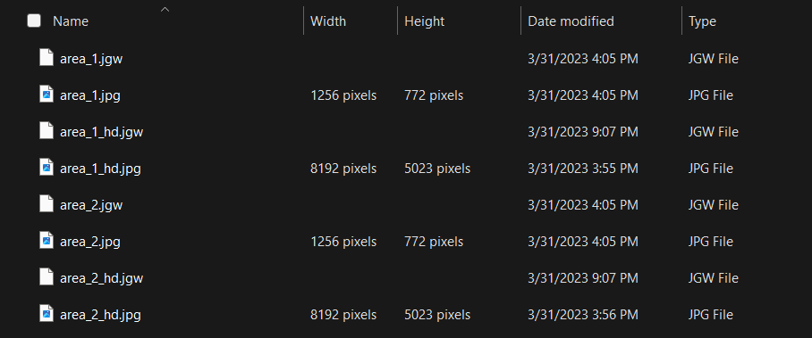

# JPG World File Resizer

## Do you have a set of JPG world files (.JGW files) you'd like to resize?


Say you have a georeferenced JPG in a lower resolution and another non-georeferenced JPG in a higher resolution which has the same geographic extent. Georeferencing the higher res JPG alone can be done using a [https://egb13.net/worldfile-calculator](world file calculator). But having a set of JPGs complicates things and that's where this Python script comes in to automate the process. This Python script reads in a list of world files (JGW files) located in a local directory of your choosing and then outputs a new "resized" world file for each input file according to the image size of the larger JPG.

## Usage
- Place **jgw-resizer.py** in the same folder as your JGWs and JPGs
- Run **jgw-resizer.py** using the command line
```
python jgw-resizer.py
```
- When prompted, input a suffix for the new JGW files, ensuring the result would have the same filename as the non-georeferenced JPGs.
- Transfer the output JGW files to the same folder as the non-georeferenced JPGs.
- Open the JPGs in your GIS of choice

## Description

This script creates a JGW file for every non-georeferenced JPG which has a georeferenced counterpart in a smaller resolution.

For each input world file, the script reads in its parameters, which include pixel size in both x and y directions, coordinates of the upper left corner of the image in world coordinates, and the dimensions of the image in pixels. The script then calculates new world coordinates using the specified original image size.

Next, the script converts these new world coordinates to latitude and longitude using the desired output image size. The script then creates a new JGW file with updated parameters. The new JGW file is then saved in the 'output/' directory with the same name as the original file, but with the added suffix specified by the user. The script repeats this process for all input JGW files.

## References
[https://egb13.net/worldfile-calculator](World File Calculator by EGB13)